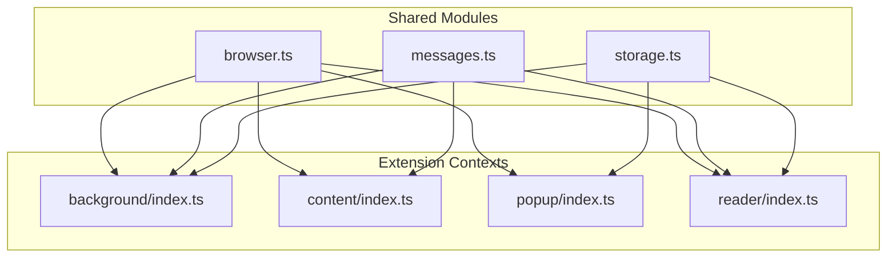
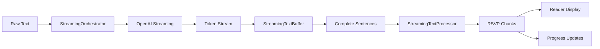

# 10x your reading speed - Extension Architecture

_Last updated: September 2025_

## 1. High-Level Overview

10x your reading speed is a cross-browser WebExtension that delivers a Rapid Serial Visual Presentation (RSVP) reading experience enhanced with AI preprocessing. The codebase is structured around four execution contexts that share a modular TypeScript core:



All entry points are authored as ES modules that import from shared packages instead of relying on global scripts. The build pipeline bundles them per browser target and produces isolated distributions in the `dist/` directory.

## 2. Source Layout

```
src/
  background/      → Modular MV3 service worker composed of:
    index.ts           → Bootstraps state priming, listeners, and testing hooks.
    state.ts           → Caches the latest selection, reader window id, and preferences.
    selection.ts       → HTML encode/decode helpers plus storage synchronisation.
    preferences.ts     → Reader preference caching and persistence.
    reader-window.ts   → Reader window lifecycle (focus/create + setup).
    message-handler.ts → Runtime message router that coordinates selection + preferences.
    listeners.ts       → Commands, context menus, install, and message wiring.
    testing-hooks.ts   → Exposes global Playwright helpers.
  common/          → Cross-context utilities (storage, message contracts, HTML + theme helpers, translation & summarisation metadata).
  content/         → Text selection capture and UX hints for web pages.
  platform/        → Runtime resolver split into `browser.ts`, `types.ts`, `wrap-chrome.ts`.
  popup/           → Action popup with quick-start controls.
  settings/        → Dedicated settings surface for advanced preferences (API providers).
  reader/          → RSVP player UI assembled from focused modules:
    index.ts            → Entrypoint that wires selection loading, controls, messaging.
    state.ts            → Central playback state container + shared helpers.
    selection-loader.ts → Loads current selection/preferences and syncs UI controls.
    controls.ts         → DOM event bindings (playback, WPM slider, theme toggle, resize).
    playback.ts         → Timer management and playback progression.
    render.ts           → Word rendering, progress display, play/pause visuals.
    text.ts             → Word preprocessing glue and chunk/font recalculation.
    streaming-text.ts   → Main streaming orchestrator for real-time text processing.
    streaming-text-buffer.ts → Token buffering for sentence-based chunk delivery.
    streaming-text-processor.ts → Real-time RSVP chunk generation from streaming text.
    timing/             → Split timing engine (`types.ts`, `word-analysis.ts`, `durations.ts`, `chunking.ts`).
    timing-engine.ts    → Barrel file exporting the timing helpers above.
    text-processor.ts   → Advanced text preprocessing (acronyms, numbers, hyphenation).
    visual-effects.ts   → Letter highlighting, positioning, flicker effects.
    openai-prompt.ts    → Builds chat completion payloads for OpenAI translation and summarisation requests.
static/
  assets/          → Icons and imagery shared across contexts.
  pages/           → HTML documents for popup, reader, settings, welcome, updated pages.
  styles/          → Scoped stylesheets injected per context.
config/
  manifest.base.json       → Canonical extension manifest definition.
  manifest.<browser>.json  → Browser overrides merged during the build.
scripts/build-extension.mjs → Esbuild-driven bundler & manifest generator.
```

Note: As part of the ongoing refactor toward the target architecture, scaffolding directories have been created to stage future migrations without changing runtime behavior:

- `src/core/` — core services (BrowserApiService, StorageService)
- `src/reader/playback/`, `src/reader/state/`, `src/reader/timing/`, `src/reader/ui/` — reader domain modules split by responsibility

These are currently placeholders; code moves will happen incrementally per story with tests kept green after each step.

## 3. Execution Contexts

### 3.1 Background Service Worker (`src/background/index.ts`)

* Responsibilities
  * Tracks the latest selection synchronised from content scripts.
  * Persists reader preferences via `storage.ts` helpers. Text selections are not persisted and each reader session uses fresh input data.
  * Owns the reader window lifecycle (`openReaderWindowSetup`) and exposes the function on `globalThis` for Playwright automation and integration tests.
  * Generates context-menu commands and keyboard shortcuts that route back into the shared open-reader workflow.
  * Normalises install/update flows by opening the welcome/updated pages from `static/pages`.
  * Delegates responsibilities to focused modules: `state.ts` (in-memory selection + prefs), `selection.ts` (state management), `reader-window.ts` (window lifecycle), `message-handler.ts` (runtime messages), and `listeners.ts` (events + commands).

* Key collaborators
  * `BrowserAPI` shim to use `chrome.*` or `browser.*` without scattering feature detection.
  * Runtime message contracts from `common/messages.ts` so that all callers share the same schema.

### 3.2 Content Script (`src/content/index.ts`)

* Observes `selectionchange`, keyboard, and mouse events to extract the active selection.
* Detects right-to-left languages with a Unicode range heuristic and forwards the normalised state to the background worker.
* Responds to background requests for mouse coordinates when the keyboard shortcut executes without a cached selection.
* Displays a transient tooltip near the cursor when the shortcut fires without a selection, guiding users to highlight text before retrying.

### 3.3 Popup (`src/popup/index.ts`)

* Loads persisted reader preferences (currently words-per-minute).
* Provides a single-line text field where users can paste content and submit it via the **Speed read it** button, which then triggers the `openReaderFromPopup` message.
* Persists preference mutations immediately to keep the background worker and reader in sync.

### 3.4 Reader UI (Modular Architecture)

The reader implementation follows a modular architecture with clear separation of concerns:

#### 3.4.1 Bootstrap & Messaging (`src/reader/index.ts`, `selection-loader.ts`, `messages.ts`)
* `index.ts` attaches a DOM-ready hook, then triggers selection loading, control registration, and runtime listener wiring.
* `selection-loader.ts` fetches current preferences/selection, normalises HTML, rebuilds timing chunks, and synchronises slider/theme UI.
* `messages.ts` listens for `refreshReader` runtime events and reuses the loader to refresh the view on demand.

#### 3.4.2 State & Playback (`src/reader/state.ts`, `playback.ts`, `controls.ts`, `render.ts`, `text.ts`)
* `state.ts` centralises the reader's playback state and surfaces helpers for timing/visual configuration.
* `text.ts` bridges preprocessing, chunk generation, and optimal font sizing whenever the active text or WPM changes.
* `render.ts` updates the DOM with the current word, status, and progress while delegating highlighting/flicker to `visual-effects.ts`.
* `playback.ts` manages timers, scheduling, and play/pause transitions, keeping state mutations predictable.
* `controls.ts` binds UI events (play/pause/restart, WPM slider, theme toggle, resize) to the playback/state modules and persists preference changes.

#### 3.4.3 Timing Engine (`src/reader/timing/…`, `timing-engine.ts`)
* `timing/word-analysis.ts` stores the word-frequency corpus, entropy calculation, punctuation heuristics, and optimal letter selection.
* `timing/durations.ts` converts analysis results + preference flags into precise word/punctuation timing.
* `timing/chunking.ts` produces `WordItem` chunks, grouping short words and applying timing bonuses where appropriate.
* `timing-engine.ts` re-exports the split modules as a single import surface for the reader UI.

#### 3.4.4 Text Processor (`src/reader/text-processor.ts`)
* Advanced text preprocessing for optimal RSVP reading experience.
* Preserves hyphenated words as-is for natural reading flow.
* Consolidates acronyms (e.g., "U S A" → "USA") for improved comprehension.
* Preserves numbers with decimals and commas (e.g., "3.14", "1,000").
* Splits very long words (>17 characters) at optimal break points.

#### 3.4.5 Visual Effects (`src/reader/visual-effects.ts`)
* Implements pixel-perfect optimal letter highlighting and positioning.
* Handles word flicker effects for improved concentration.
* Manages CSS transforms for precise letter centering in the viewport.
* Wraps individual letters in spans for granular styling control.

### 3.5 Settings Page (`src/settings/index.ts`)

* Exposed via the gear icon in the popup and reader footer as well as the extension options entry.
* Applies the persisted reader theme so the experience matches the active light or dark mode.
* Loads the OpenAI API key, preferred translation language, and summarisation level from storage, lets users update or clear them, and surfaces inline success or error feedback.
* Target language options and summarisation levels live alongside storage helpers so the OpenAI provider can build prompts dynamically.

## 4. Cross-Cutting Modules

* `platform/browser.ts`: resolves the runtime API once, exposes a shared `browser` singleton, and uses wrapper helpers from `platform/types.ts` + `platform/wrap-chrome.ts` to collapse Chrome/Firefox/Safari differences.
* `common/storage.ts`: wraps the callback-driven storage API with promise helpers, defines canonical keys, and centralises preference persistence.
* `common/messages.ts`: enumerates every structured message exchanged between contexts, enabling exhaustive checks during refactors.
* `common/html.ts`: ensures consistent HTML encoding/decoding for text selections and rendered reader output.
* `common/theme.ts`: applies theme classes/dataset toggles so the popup and reader stay visually aligned.

## 5. Build & Packaging Pipeline

* `scripts/build-extension.mjs`
  * Parses a browser target (`chrome`, `firefox`, `safari`; default `chrome`).
  * Cleans `dist/<browser>/` and copies static assets (`static/pages`, `static/styles`, `static/assets`).
  * Bundles the four TypeScript entry points into ES module outputs under `dist/<browser>/scripts/` with source maps enabled.
  * Deep-merges `config/manifest.base.json` with any browser-specific override before emitting `dist/<browser>/manifest.json`.

* Example invocations

```bash
npm run build:chrome
npm run build:firefox
npm run build:safari
```

Each command prepares a fully self-contained directory that can be zipped for store submission or side-loaded into a browser.

## 6. Browser Targets

* **Chrome**: Uses the base manifest verbatim, relying on the MV3 service worker entry generated by the bundler.
* **Firefox**: Shares the same MV3 bundle while injecting `browser_specific_settings.gecko` metadata to enable signing.
* **Safari**: Keeps metadata overrides lightweight—`safari-web-extension-converter` can ingest the generated directory to create an Xcode project.

## 7. Testing Strategy

The testing strategy combines unit tests for isolated component testing with end-to-end tests for full user workflows.

### 7.1 Unit Tests

* Unit tests are implemented with [Vitest](https://vitest.dev/) and located co-located with source files using `.spec.ts` extension.
* Tests provide fast, isolated testing of individual functions and modules without requiring browser contexts.
* Current coverage includes core utilities like HTML encoding/decoding functions in `src/common/html.spec.ts`.
* The modular reader architecture (`timing-engine.ts`, `text-processor.ts`, `visual-effects.ts`) enables comprehensive unit testing of individual algorithms.
* Unit tests can directly import modules under `src/common`, `src/platform`, and `src/reader` for isolated testing.

### 7.2 End-to-End Tests

* Playwright tests are executed against the built Chrome bundle (`dist/chrome`). The `npm test` script automatically runs the build before launching the browser.
* Tests exercise the background worker APIs directly (`openReaderWindowSetup`), wait for the reader window, and verify playbook behaviour by asserting that words progress after toggling play.
* Comprehensive coverage includes:
  * Reader window opening and basic playback functionality
  * Optimal letter highlighting and pixel-perfect centering verification
  * Advanced timing algorithm validation with word frequency differences
  * Text preprocessing capabilities (acronym consolidation, number preservation, hyphen preservation)
  * Chunking logic for short word grouping
* OpenAI integration test requires a real API key. Set `OPENAI_API_KEY` in the environment before running the suite to validate live provider behavior (no mocks or fallbacks).

## 7.5. Text Preprocessing Architecture

The text preprocessing system provides an extensible, provider-based architecture for text enhancement and translation.

### 7.5.1 Provider Architecture

```typescript
interface PreprocessingProvider {
  name: string
  process(text: string): Promise<PreprocessingResult>
  isAvailable(): boolean
}
interface PreprocessingResult {
  text: string
  metadata?: {
    originalLength: number
    processedLength: number
    wasModified: boolean
    provider: string
    processingTime?: number
  }
}
```

### 7.5.2 Current Providers

* **OpenAI Provider**: Translates text to the configured target language using the model from service defaults/config
  * Requires API key stored in extension storage or environment variable
  * Includes 10-second timeout and error handling
  * Automatically falls back if unavailable

* **Passthrough Provider**: Returns text unchanged
  * Always available as fallback
  * Zero processing time
  * Used when no other providers are available

### 7.5.3 Provider Selection Logic

The system automatically selects the best available provider:

1. **Check OpenAI availability**: If API key is present and valid
2. **Fallback to Passthrough**: If OpenAI fails or unavailable
3. **Error handling**: Each provider can fail gracefully to the next

### 7.5.4 Configuration and Security

* **API Key Storage**: Securely stored in Chrome extension storage
* **User Configuration**: API key entered via popup interface
* **Automatic Fallback**: No configuration needed - system handles provider selection
* **No Key Leakage**: API keys never logged or exposed in client code

### 7.5.5 Implementation Details

The preprocessing system is implemented under `src/preprocessing/` with:

* **Provider Classes**: `providers/openai.ts`, `providers/passthrough.ts` implementing `PreprocessingProvider`
* **Manager**: `manager.ts` handling provider selection and fallback logic
* **Streaming Manager**: `streaming-manager.ts` coordinating real-time streaming with OpenAI provider
* **Integration**: Seamlessly integrated into the reader text processing pipeline
* **Storage Integration**: Uses extension storage for API key persistence
### 7.5.6 Future Extensibility

The architecture supports easy addition of new providers:

```typescript
class CustomProvider implements PreprocessingProvider {
  name = 'custom'
  async isAvailable() { /* check availability */ }
  async process(text) { /* process text */ }
}
```

Future providers could include:
* **Proxy Provider**: Authenticated requests through custom server
* **Local AI Provider**: Chrome's built-in AI APIs for on-device processing
* **Translation Services**: Google Translate, DeepL, etc.

## 7.6. Real-Time Streaming Architecture

The streaming system enables progressive text processing and immediate content availability, significantly improving user experience by starting playback before all preprocessing is complete.

### 7.6.1 Streaming Components

The streaming system consists of several coordinated modules under `src/reader/` and `src/preprocessing/`:

* **StreamingTextOrchestrator** (`streaming-text.ts`): Main coordinator that manages the entire streaming pipeline
* **StreamingTextBuffer** (`streaming-text-buffer.ts`): Buffers incoming tokens until complete sentences are formed
* **StreamingTextProcessor** (`streaming-text-processor.ts`): Converts text chunks into RSVP word items in real-time
* **StreamingPreprocessingManager** (`streaming-manager.ts`): Coordinates streaming with OpenAI provider

### 7.6.2 Streaming Flow



### 7.6.3 Progressive Processing

1. **Immediate Start**: Text processing begins immediately when content is loaded
2. **Token-Level Streaming**: OpenAI tokens are processed as they arrive from the API
3. **Sentence Buffering**: Tokens are buffered until complete sentences are formed
4. **Chunk Generation**: Complete sentences are immediately converted to RSVP chunks
5. **Progressive Display**: Users can start reading while processing continues in background

### 7.6.4 Feature Detection

The system intelligently enables streaming based on available configuration:

```typescript
// Automatic feature detection
const shouldUseStreaming = await shouldEnableStreaming()
if (shouldUseStreaming) {
  await setWordsWithStreaming(tokens)
} else {
  await setWords(tokens) // Traditional processing
}
```

* **With OpenAI API Key**: Full streaming processing with real-time progress
* **Without API Key**: Graceful fallback to traditional preprocessing
* **Error Handling**: Automatic fallback on streaming failures

#### Requirements for Streaming

* Valid OpenAI API key configured in the extension settings panel
* Active internet connection to establish streaming requests to OpenAI
* Available API quota to prevent mid-stream interruptions

### 7.6.5 UI Integration

The streaming system provides enhanced visual feedback:

* **Real-time Progress**: Visual progress bar shows processing percentage
* **Status Messages**: Clear indication of streaming state ("Processing...", "Loading...")
* **Progressive Availability**: Content becomes readable as soon as sufficient chunks are processed
* **Smooth Transitions**: Seamless state changes between streaming and reading modes

### 7.6.6 Performance Optimizations

* **Non-blocking Processing**: UI remains responsive during streaming
* **Efficient Memory Management**: Streaming buffers are cleaned up automatically
* **Minimal DOM Updates**: Progress updates are batched to prevent UI blocking
* **Graceful Degradation**: System falls back to traditional processing on any streaming error

## 8. Future Evolution

* Expand the manifest overrides to capture Firefox-specific permission tweaks (e.g., action button behaviour) and Safari-specific entitlements.
* Introduce dedicated unit tests for the reader timing logic and storage helpers.
* Integrate localisation by moving human-readable strings into a shared message catalog consumed across contexts.
