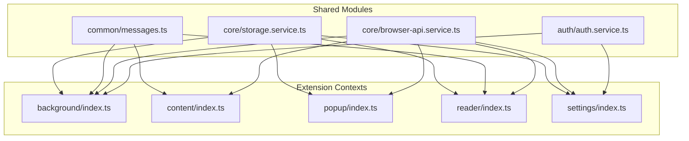
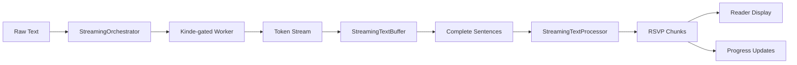

# 10x your reading speed - Extension Architecture

_Last updated: September 2025_

## 1. High-Level Overview

10x your reading speed is a cross-browser WebExtension that delivers a Rapid Serial Visual Presentation (RSVP) reading experience enhanced with AI preprocessing. The codebase is structured around four execution contexts that share a modular TypeScript core:



All entry points are authored as ES modules that import from shared packages instead of relying on global scripts. The build pipeline bundles them per browser target and produces isolated distributions in the `dist/` directory.

## 2. Source Layout

```
src/
  auth/              → Kinde authentication module:
    index.ts           → Barrel export for auth service, provider, types, and store.
    auth.service.ts    → Main service for login, logout, and state management.
    providers/         → Authentication provider implementations (e.g., Kinde).
    state/             → Zustand store for authentication state.
    types/             → User and authentication-related types.
  background/      → Modular MV3 service worker composed of:
    index.ts           → Bootstraps state priming, listeners, and testing hooks.
    state.ts           → Caches the latest selection, reader window id, and preferences.
    selection.ts       → HTML encode/decode helpers plus storage synchronisation.
    preferences.ts     → Reader preference caching and persistence.
    reader-window.ts   → Reader window lifecycle (focus/create + setup).
    message-handler.ts → Runtime message router that coordinates selection + preferences.
    listeners.ts       → Commands, context menus, install, and message wiring.
    testing-hooks.ts   → Exposes global Playwright helpers.
  common/          → Cross-context utilities (storage, message contracts, HTML + theme helpers, translation & summarisation metadata).
  content/         → Text selection capture and UX hints for web pages.
  core/            → Browser API service and adapters (`browser-api.service.ts`, `chrome-adapter.ts`, types).
  popup/           → Action popup with quick-start controls.
  settings/        → Dedicated settings surface for advanced preferences and authentication.
  reader/          → RSVP player UI assembled from focused modules:
    index.ts            → Entrypoint that wires selection loading, controls, messaging.
    state/              → Zustand-based state management:
      reader.store.ts      → Centralized Zustand store for all reader state
    selection-loader.ts → Loads current selection/preferences and syncs UI controls.
    playback/           → Service-oriented playback management:
      playback.service.ts  → Owns timer scheduling and playback progression.
    ui/renderer.ts      → Store-driven word rendering, progress display, play/pause visuals.
    ui/controls.ts      → Modern control bindings wired to store and PlaybackService.
    text.ts             → Word preprocessing glue and chunk/font recalculation.
    streaming-text.ts   → Main streaming orchestrator for real-time text processing.
    streaming-text-buffer.ts → Token buffering for sentence-based chunk delivery.
    streaming-text-processor.ts → Real-time RSVP chunk generation from streaming text.
    timing/             → Split timing engine with `timing.service.ts` wrapper
    timing-engine.ts    → Barrel file exporting the timing helpers above.
    text-processor.ts   → Advanced text preprocessing (acronyms, numbers, hyphenation).
    visual-effects.ts   → Letter highlighting, positioning, flicker effects.
    openai-prompt.ts    → Builds chat completion payloads for the Kinde-gated worker.
    ui/                 → UI layer components:
      renderer.ts          → Store-driven DOM updates
      controls.ts          → Control event bindings
static/
  assets/          → Icons and imagery shared across contexts.
  pages/           → HTML documents for popup, reader, settings, and the welcome onboarding page.
    welcome.html      → Interactive onboarding with context-menu walkthrough, copy helpers, and theme-aware CTAs.
  styles/          → Scoped stylesheets injected per context.
config/
  manifest.base.json       → Canonical extension manifest definition.
  manifest.<browser>.json  → Browser overrides merged during the build.
scripts/build-extension.mjs → Esbuild-driven bundler & manifest generator.
```

The service-oriented architecture is fully implemented with the following structure:

- `src/core/` — core services (BrowserApiService, StorageService)
- `src/auth/` — authentication service (AuthService, KindeProvider)
- `src/reader/state/` — Zustand store for centralized reader state
- `src/auth/state/` — Zustand store for centralized auth state
- `src/reader/playback/` — PlaybackService managing timer scheduling and progression
- `src/reader/timing/` — TimingService wrapper for word timing calculations
- `src/reader/ui/` — Store-driven UI components (renderer, controls)

The codebase is fully service‑oriented and store‑driven.

## 3. Execution Contexts

### 3.1 Background Service Worker (`src/background/index.ts`)

* Responsibilities
  * Initializes the authentication service on startup.
  * Tracks the latest selection synchronised from content scripts.
  * Persists reader preferences via `storage.ts` helpers. Text selections are not persisted and each reader session uses fresh input data.
  * Owns the reader window lifecycle (`openReaderWindowSetup`) and exposes the function on `globalThis` for Playwright automation and integration tests.
  * Generates context-menu commands and keyboard shortcuts that route back into the shared open-reader workflow.
  * Normalises install/update flows by opening the shared welcome onboarding page from `static/pages`.
  * Delegates responsibilities to focused modules: `state.ts` (in-memory selection + prefs), `selection.ts` (state management), `reader-window.ts` (window lifecycle), `message-handler.ts` (runtime messages), and `listeners.ts` (events + commands).

* Key collaborators
  * `BrowserAPI` shim to use `chrome.*` or `browser.*` without scattering feature detection.
  * Runtime message contracts from `common/messages.ts` so that all callers share the same schema.
  * `AuthService` to manage user authentication state.

### 3.2 Content Script (`src/content/index.ts`)

* Observes `selectionchange`, keyboard, and mouse events to extract the active selection.
* Detects right-to-left languages with a Unicode range heuristic and forwards the normalised state to the background worker.
* Responds to background requests for mouse coordinates when the keyboard shortcut executes without a cached selection.
* Displays a transient tooltip near the cursor when the shortcut fires without a selection, guiding users to highlight text before retrying.

### 3.3 Popup (`src/popup/index.ts`)

* Loads persisted reader preferences (currently words-per-minute).
* Provides a single-line text field where users can paste content and submit it via the **Speed read it** button, which then triggers the `openReaderFromPopup` message.
* Persists preference mutations immediately to keep the background worker and reader in sync.

### 3.4 Reader UI (Modular Architecture)

The reader implementation follows a modular architecture with clear separation of concerns:

#### 3.4.1 Bootstrap & Messaging (`src/reader/index.ts`, `selection-loader.ts`, `messages.ts`)
* `index.ts` attaches a DOM-ready hook, then triggers selection loading, control registration, and runtime listener wiring.
* `selection-loader.ts` fetches current preferences/selection, normalises HTML, rebuilds timing chunks, and synchronises slider/theme UI.
* `messages.ts` listens for `refreshReader` runtime events and reuses the loader to refresh the view on demand.

#### 3.4.2 State & Playback (`src/reader/state/reader.store.ts`, `playback/playback.service.ts`, `ui/controls.ts`, `text.ts`, `ui/renderer.ts`)
* `state/reader.store.ts` centralises the reader's playback state and surfaces helpers for timing/visual configuration.
* `text.ts` bridges preprocessing, chunk generation, and optimal font sizing whenever the active text or WPM changes.
* `ui/renderer.ts` is the sole DOM writer: it updates the current word, status, and progress while delegating highlighting/flicker to `visual-effects.ts`.
* `playback/playback.service.ts` manages timers, scheduling, and play/pause transitions, keeping state mutations predictable.
* `ui/controls.ts` binds UI events (play/pause/restart, WPM slider, theme toggle, resize) to the PlaybackService and store, and persists preference changes.

#### 3.4.3 Timing Engine (`src/reader/timing/…`, `timing-engine.ts`)
* `timing/word-analysis.ts` stores the word-frequency corpus, entropy calculation, punctuation heuristics, and optimal letter selection.
* `timing/durations.ts` converts analysis results + preference flags into precise word/punctuation timing.
* `timing/chunking.ts` produces `WordItem` chunks, grouping short words and applying timing bonuses where appropriate.
* `timing-engine.ts` re-exports the split modules as a single import surface for the reader UI.

#### 3.4.4 Text Processor (`src/reader/text-processor.ts`)
* Advanced text preprocessing for optimal RSVP reading experience.
* Preserves hyphenated words as-is for natural reading flow.
* Consolidates acronyms (e.g., "U S A" → "USA") for improved comprehension.
* Preserves numbers with decimals and commas (e.g., "3.14", "1,000").
* Splits very long words (>17 characters) at optimal break points.

#### 3.4.5 Visual Effects (`src/reader/visual-effects.ts`)
* Implements pixel-perfect optimal letter highlighting and positioning.
* Handles word flicker effects for improved concentration.
* Manages CSS transforms for precise letter centering in the viewport.
* Wraps individual letters in spans for granular styling control.

### 3.5 Settings Page (`src/settings/index.ts`)

* Exposed via the gear icon in the popup and reader footer as well as the extension options entry.
* Applies the persisted reader theme so the experience matches the active light or dark mode.
* Manages Kinde authentication, allowing users to sign in and out.
* Displays user profile information and subscription status.
* Loads preferred translation language and summarisation level from storage, lets users update or clear them, and surfaces inline success or error feedback.

## 4. Cross-Cutting Modules

* `core/browser-api.service.ts`: resolves the runtime API once, exposes a shared `browserApi` service, and adapts raw `chrome.*` into a Promise‑based `MinimalBrowserAPI` for all contexts.
* `common/storage.ts`: wraps the callback-driven storage API with promise helpers, defines canonical keys, and centralises preference persistence.
* `common/messages.ts`: enumerates every structured message exchanged between contexts, enabling exhaustive checks during refactors.
* `common/html.ts`: ensures consistent HTML encoding/decoding for text selections and rendered reader output.
* `common/theme.ts`: applies theme classes/dataset toggles so the popup and reader stay visually aligned.

## 5. Build & Packaging Pipeline

* `scripts/build-extension.mjs`
  * Parses a browser target (`chrome`, `firefox`, `safari`; default `chrome`).
  * Cleans `dist/<browser>/` and copies static assets (`static/pages`, `static/styles`, `static/assets`).
  * Bundles the four TypeScript entry points into ES module outputs under `dist/<browser>/scripts/` with source maps enabled.
  * Injects environment variables (e.g., Kinde client ID) into the manifest.
  * Deep-merges `config/manifest.base.json` with any browser-specific override before emitting `dist/<browser>/manifest.json`.

* Example invocations

```bash
npm run build:chrome
npm run build:firefox
npm run build:safari
```

Each command prepares a fully self-contained directory that can be zipped for store submission or side-loaded into a browser.

## 6. Browser Targets

* **Chrome**: Uses the base manifest verbatim, relying on the MV3 service worker entry generated by the bundler.
* **Firefox**: Shares the same MV3 bundle while injecting `browser_specific_settings.gecko` metadata to enable signing.
* **Safari**: Keeps metadata overrides lightweight—`safari-web-extension-converter` can ingest the generated directory to create an Xcode project.

## 7. Authentication Architecture

The extension uses Kinde for authentication, enabling access to premium AI-powered features.

### 7.1 Core Components
- **`AuthService` (`src/auth/auth.service.ts`)**: A singleton service that orchestrates the entire authentication flow, including login, logout, state management, and subscription checks.
- **`KindeProvider` (`src/auth/providers/kinde.provider.ts`)**: Implements the `AuthProvider` interface and handles all communication with Kinde, using `chrome.identity.launchWebAuthFlow` for the OAuth2 PKCE flow.
- **`useAuthStore` (`src/auth/state/auth.store.ts`)**: A Zustand store that serves as the single source of truth for authentication state (user, token, loading status, etc.) across the extension.

### 7.2 Authentication Flow
1.  User clicks "Sign In" on the settings page or the welcome CTA.
2.  `AuthService.login()` is called, which delegates to `KindeProvider.login()`.
3.  The provider constructs the Kinde authorization URL with PKCE parameters and `prompt=create` so the hosted UI opens on the registration screen (users can still switch to sign-in from there).
4.  `chrome.identity.launchWebAuthFlow` opens a new window for Kinde authentication.
5.  After successful login, Kinde redirects to a special `chromiumapp.org` URL.
6.  The extension captures the authorization code from the redirect URL.
7.  The provider exchanges the code for an access token by calling Kinde's token endpoint.
8.  The user profile and token are stored securely in `chrome.storage.local`.
9.  The `useAuthStore` is updated, and the UI reacts to show the authenticated state.

### 7.3 State Management
- The `AuthService` initializes on browser startup, checking for a valid session in storage and updating the `useAuthStore` accordingly.
- All UI components that need authentication information subscribe to the `useAuthStore` for reactive updates.

## 8. Testing Strategy

The testing strategy combines unit tests for isolated component testing with end-to-end tests for full user workflows.

### 8.1 Unit Tests

* Unit tests are implemented with [Vitest](https://vitest.dev/) and located co-located with source files using `.spec.ts` extension.
* Tests provide fast, isolated testing of individual functions and modules without requiring browser contexts.
* Current coverage includes core utilities like HTML encoding/decoding functions in `src/common/html.spec.ts`.
* The modular reader architecture (`timing-engine.ts`, `text-processor.ts`, `visual-effects.ts`) enables comprehensive unit testing of individual algorithms.
* Unit tests can directly import modules under `src/common`, `src/core`, and `src/reader` for isolated testing.

### 8.2 End-to-End Tests

* Playwright tests are executed against the built Chrome bundle (`dist/chrome`). The `npm test` script automatically runs the build before launching the browser.
* Tests run in parallel by default with the number of workers equal to the machine's CPU cores; override with `--workers` when needed.
* Tests exercise the background worker APIs directly (`openReaderWindowSetup`), wait for the reader window, and verify playbook behaviour by asserting that words progress after toggling play.
* Comprehensive coverage includes:
  * Reader window opening and basic playback functionality
  * Optimal letter highlighting and pixel-perfect centering verification
  * Advanced timing algorithm validation with word frequency differences
  * Text preprocessing capabilities (acronym consolidation, number preservation, hyphen preservation)
  * Chunking logic for short word grouping
* Kinde-gated AI integration tests require a dev token. Set `VITE_DEV_PRO_TOKEN` in your `.env` file to run these tests.

## 9. Text Preprocessing Architecture

The text preprocessing system provides an extensible, provider-based architecture for text enhancement and translation.

### 9.1 Provider Architecture

```typescript
interface PreprocessingProvider {
  name: string
  process(text: string): Promise<PreprocessingResult>
  isAvailable(): boolean
}
interface PreprocessingResult {
  text: string
  metadata?: {
    originalLength: number
    processedLength: number
    wasModified: boolean
    provider: string
    processingTime?: number
  }
}
```

### 9.2 Current Providers

* **`OpenAIProvider`**: Sends text to a Kinde-gated Cloudflare worker for translation and summarization.
  * Requires an authenticated user session.
  * Includes a 30-second timeout and error handling.
* **`PassthroughProvider`**: Returns text unchanged.
  * Used when AI preprocessing is disabled.

### 9.3 Provider Selection Logic

The system automatically selects the best available provider:

1.  **Check `OpenAIProvider` availability**: Checks if the user is authenticated.
2.  **Fallback to `PassthroughProvider`**: If the user is not authenticated or AI preprocessing is disabled.

### 9.4 Configuration and Security

* **Authentication**: AI features are only available to authenticated users with a valid Kinde session.
* **API Calls**: All calls to the AI worker are authenticated with the user's Kinde access token.

## 10. Real-Time Streaming Architecture

The streaming system enables progressive text processing and immediate content availability, significantly improving user experience by starting playback before all preprocessing is complete.

### 10.1 Streaming Components

The streaming system consists of several coordinated modules under `src/reader/` and `src/preprocessing/`:

* **`StreamingTextOrchestrator` (`streaming-text.ts`)**: Main coordinator that manages the entire streaming pipeline
* **`StreamingTextBuffer` (`streaming-text-buffer.ts`)**: Buffers incoming tokens until complete sentences are formed
* **`StreamingTextProcessor` (`streaming-text-processor.ts`)**: Converts text chunks into RSVP word items in real-time
* **`OpenAIProvider` (`src/preprocessing/providers/openai.ts`)**: Handles the streaming request to the Kinde-gated worker.

### 10.2 Streaming Flow



### 10.3 Progressive Processing

1.  **Immediate Start**: Text processing begins immediately when content is loaded
2.  **Token-Level Streaming**: Tokens from the worker are processed as they arrive.
3.  **Sentence Buffering**: Tokens are buffered until complete sentences are formed
4.  **Chunk Generation**: Complete sentences are immediately converted to RSVP chunks
5.  **Progressive Display**: Users can start reading while processing continues in background

### 10.4 Feature Detection

The system intelligently enables streaming based on user authentication:

* **Authenticated User**: Full streaming processing with real-time progress.
* **Guest User**: Graceful fallback to traditional, local text processing.
* **Error Handling**: Automatic fallback on streaming failures, with an error message displayed to the user.

### 10.5 UI Integration

The streaming system provides enhanced visual feedback:

* **Real-time Progress**: Visual progress bar shows processing percentage
* **Status Messages**: Clear indication of streaming state ("Processing...", "Loading...")
* **Error Messages**: A red bubble appears if preprocessing fails.
* **Progressive Availability**: Content becomes readable as soon as sufficient chunks are processed
* **Smooth Transitions**: Seamless state changes between streaming and reading modes

## 11. Future Evolution

* Expand the manifest overrides to capture Firefox-specific permission tweaks (e.g., action button behaviour) and Safari-specific entitlements.
* Introduce dedicated unit tests for the reader timing logic and storage helpers.
* Integrate localisation by moving human-readable strings into a shared message catalog consumed across contexts.
