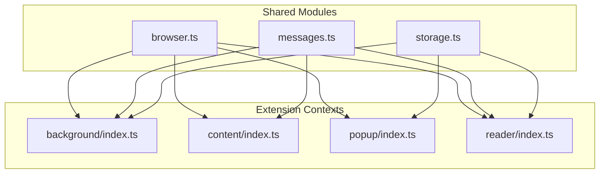

# Sprint Reader Extension Architecture

_Last updated: February 2025_

## 1. High-Level Overview

Sprint Reader is a cross-browser WebExtension that delivers a Rapid Serial Visual Presentation (RSVP) reading experience. The codebase is structured around four execution contexts that share a modular TypeScript core:



All entry points are authored as ES modules that import from shared packages instead of relying on global scripts. The build pipeline bundles them per browser target and produces isolated distributions in the `dist/` directory.

## 2. Source Layout

```
src/
  background/      → Service worker orchestration, context menus, command handling.
  common/          → Cross-context utilities (storage, message contracts).
  content/         → Text selection capture and UX hints for web pages.
  platform/        → Thin abstraction that resolves the `chrome`/`browser` runtime.
  popup/           → Action popup with quick-start controls.
  reader/          → RSVP player UI and playback logic.
static/
  assets/          → Icons and imagery shared across contexts.
  pages/           → HTML documents for popup, reader, welcome, updated pages.
  styles/          → Scoped stylesheets injected per context.
config/
  manifest.base.json       → Canonical extension manifest definition.
  manifest.<browser>.json  → Browser overrides merged during the build.
scripts/build-extension.mjs → Esbuild-driven bundler & manifest generator.
```

## 3. Execution Contexts

### 3.1 Background Service Worker (`src/background/index.ts`)

* Responsibilities
  * Tracks the latest selection synchronised from content scripts.
  * Persists reader preferences and selection history via `storage.ts` helpers.
  * Owns the reader window lifecycle (`openReaderWindowSetup`) and exposes the function on `globalThis` for Playwright automation and integration tests.
  * Generates context-menu commands and keyboard shortcuts that route back into the shared open-reader workflow.
  * Normalises install/update flows by opening the welcome/updated pages from `static/pages`.

* Key collaborators
  * `readSelectionHistory()` to fetch history when the "read last" menu item is triggered.
  * `BrowserAPI` shim to use `chrome.*` or `browser.*` without scattering feature detection.
  * Runtime message contracts from `common/messages.ts` so that all callers share the same schema.

### 3.2 Content Script (`src/content/index.ts`)

* Observes `selectionchange`, keyboard, and mouse events to extract the active selection.
* Detects right-to-left languages with a Unicode range heuristic and forwards the normalised state to the background worker.
* Renders an unobtrusive hint bubble (`.sprint-reader__selection-hint`) that anchors near the cursor, encouraging users to trigger the shortcut.
* Responds to background requests for mouse coordinates when the keyboard shortcut executes without a cached selection.

### 3.3 Popup (`src/popup/index.ts`)

* Loads persisted reader preferences (words-per-minute, persist-selection toggle).
* Sends a single `openReaderFromPopup` message that the background worker interprets, either replaying the last saved text or opening with explicit input.
* Persists preference mutations immediately to keep the background worker and reader in sync.

### 3.4 Reader UI (`src/reader/index.ts`)

* Fetches the latest stored selection and preferences and renders them into `static/pages/reader.html`.
* Provides play/pause, restart, and speed adjustment controls with real-time progress feedback.
* Keeps playback state in a dedicated module-level state object so that UI rendering and timers remain predictable.
* Listens for the `refreshReader` runtime message to reload content when the background window requests a refresh (e.g., reopening the reader while it is already focused).

## 4. Cross-Cutting Modules

* `platform/browser.ts`: resolves the runtime API once and caches it, collapsing the Chrome/Firefox/Safari divergence into a single entry point.
* `common/storage.ts`: wraps the callback-driven storage API with promise helpers, defines canonical keys, and centralises history management.
* `common/messages.ts`: enumerates every structured message exchanged between contexts, enabling exhaustive checks during refactors.

## 5. Build & Packaging Pipeline

* `scripts/build-extension.mjs`
  * Parses a browser target (`chrome`, `firefox`, `safari`; default `chrome`).
  * Cleans `dist/<browser>/` and copies static assets (`static/pages`, `static/styles`, `static/assets`).
  * Bundles the four TypeScript entry points into ES module outputs under `dist/<browser>/scripts/` with source maps enabled.
  * Deep-merges `config/manifest.base.json` with any browser-specific override before emitting `dist/<browser>/manifest.json`.

* Example invocations

```bash
npm run build:chrome
npm run build:firefox
npm run build:safari
```

Each command prepares a fully self-contained directory that can be zipped for store submission or side-loaded into a browser.

## 6. Browser Targets

* **Chrome**: Uses the base manifest verbatim, relying on the MV3 service worker entry generated by the bundler.
* **Firefox**: Shares the same MV3 bundle while injecting `browser_specific_settings.gecko` metadata to enable signing.
* **Safari**: Keeps metadata overrides lightweight—`safari-web-extension-converter` can ingest the generated directory to create an Xcode project.

## 7. Testing Strategy

* Playwright tests are executed against the built Chrome bundle (`dist/chrome`). The `npm test` script automatically runs the build before launching the browser.
* Tests exercise the background worker APIs directly (`openReaderWindowSetup`), wait for the reader window, and verify playback behaviour by asserting that words progress after toggling play.
* The modular architecture keeps shared utilities isolated, which will ease future unit-test coverage; modules under `src/common` and `src/platform` can be imported directly by Jest/Vitest in future work.

## 8. Future Evolution

* Expand the manifest overrides to capture Firefox-specific permission tweaks (e.g., action button behaviour) and Safari-specific entitlements.
* Introduce dedicated unit tests for the reader timing logic and storage history helpers.
* Integrate localisation by moving human-readable strings into a shared message catalog consumed across contexts.
