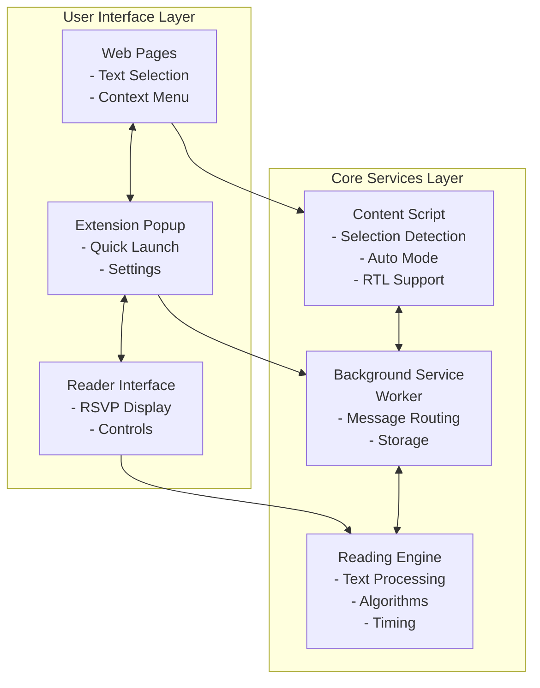
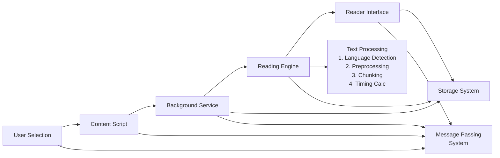
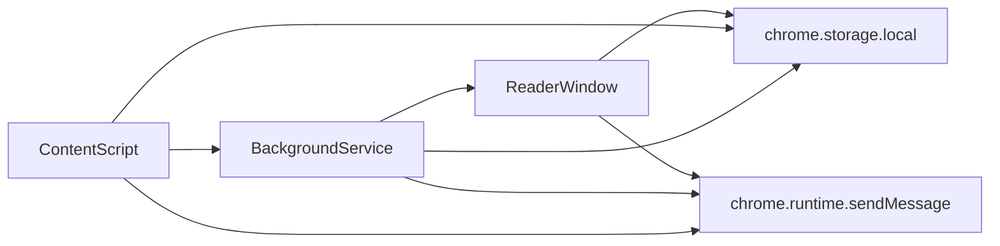
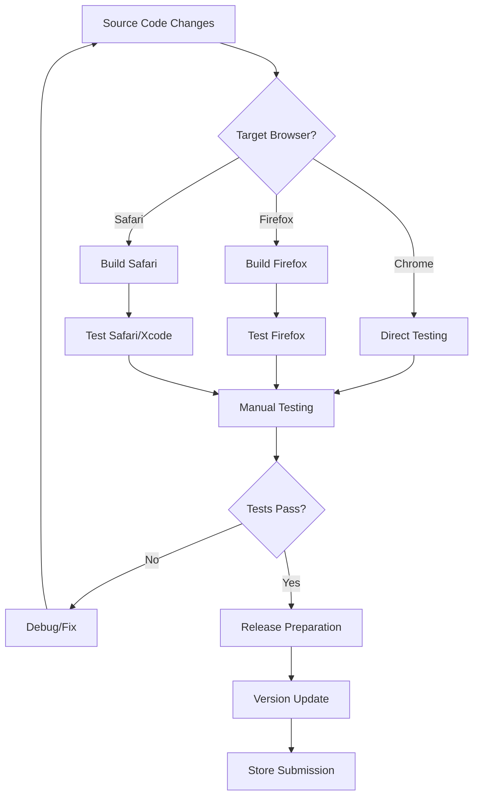

# Sprint Reader Chrome Extension - Architecture Documentation

## Project Overview

**Sprint Reader** is a sophisticated speed reading Chrome extension that implements Rapid Serial Visual Presentation (RSVP) technique, enabling users to read text at speeds up to 1800+ words per minute.

## System Architecture

### High-Level Architecture Diagram



### Component Architecture

#### 1. Background Service Worker (`background.js`)
**Role**: Central coordination hub and extension lifecycle management

```javascript
// Core responsibilities:
class BackgroundService {
  // Version and update management
  handleVersionUpdates();

  // Context menu integration
  createContextMenus();

  // Window management
  createReaderWindow();

  // Message routing between components
  routeMessages();

  // Text selection history (up to 3 items)
  manageSelectionHistory();

  // Keyboard shortcut handling
  processKeyboardCommands();
}
```

**Key Features**:
- Manifest V3 service worker compatibility
- Cross-component message passing
- Persistent storage management
- Context menu integration
- Keyboard shortcut support (Ctrl+Shift+E)

#### 2. Content Scripts (`content.js`)
**Role**: Web page interaction and text capture

```javascript
// Web page integration
class ContentScript {
  // Text selection detection
  captureUserSelection();

  // RTL script detection
  detectTextDirection();

  // Auto-selection mode with hotkeys
  handleAutoSelection(); // Ctrl+Shift toggle

  // Mouse tracking for shortcuts
  trackMousePosition();

  // Communication with background
  sendSelectionToBackground();
}
```

**Integration Points**:
- Injects CSS for visual feedback
- Communicates via chrome.runtime.sendMessage
- Supports multiple text selection methods
- Language direction detection

#### 3. Reading Engine (`engine.js`)
**Role**: Core text processing and timing algorithms

```javascript
// Text processing pipeline
class ReadingEngine {
  // Text preprocessing
  splitTextToArray_FirstPass(text);     // Initial chunking
  splitTextToArray_SecondPass(chunks);  // Refinement

  // Advanced text processing
  handleHyphenatedWords();
  splitLongWords();                     // >17 characters
  consolidateAcronyms();
  preserveNumbersDecimals();

  // Timing calculation algorithms
  calculateBasicTiming(wpm);            // Fixed WPM
  calculateWordLengthTiming(word);      // Character-based
  calculateWordFrequencyTiming(word);   // Shannon entropy
}
```

**Supported Algorithms**:
1. **Basic**: Fixed words-per-minute timing
2. **Word Length**: Duration scales with character count
3. **Word Frequency**: Information theory-based timing using Shannon entropy

**Language Support**:
- 60+ languages via guess-language library
- RTL script support (Arabic, Hebrew)
- Multi-byte character handling

#### 4. Reader Interface (`reader.js`)
**Role**: Main reading display and user interaction

```javascript
// User interface management
class ReaderInterface {
  // Display configuration
  setupColorSchemes();        // 16 available schemes
  configureTextPositioning(); // Centered, left, optimal
  setupFocalGuides();         // Eye tracking aids

  // Reading control
  startReading();
  pauseReading();
  adjustWPM();               // Z/X keys, range: 30-2000+

  // Progress tracking
  updateProgressIndicator();
  displaySentenceContext();

  // Settings management
  saveUserPreferences();
  loadUserSettings();
}
```

**Display Features**:
- Optimal letter highlighting for focus
- Static focal character positioning
- Configurable pause timing after punctuation
- Word flicker effects for enhanced concentration

#### 5. Popup Interface (`popup.js`)
**Role**: Extension toolbar interface

Simple launcher interface providing:
- Quick reader access
- Settings shortcut
- Extension status display

#### 6. Utility Functions (`utility.js`)
**Role**: Shared functionality and advanced features

```javascript
// Utility services
class UtilityService {
  // Storage management
  manageExtensionStorage();

  // Language detection
  detectContentLanguage();

  // HTML processing
  encodeHtmlEntities();

  // SVG and graphics
  handleSvgElements();

  // Advanced settings
  manageAdvancedConfiguration();
}
```

## Data Flow Architecture

### Text Processing Pipeline



### Message Passing Architecture

```javascript
// Inter-component communication
const MessageTypes = {
  TEXT_SELECTED: 'textSelected',
  OPEN_READER: 'openReader',
  READER_READY: 'readerReady',
  START_READING: 'startReading',
  SETTINGS_UPDATED: 'settingsUpdated'
};
```
// Message flow patterns



## Cross-Browser Architecture

### Build System Structure

```
src/                          # Core source code
├── background.js            # Chrome version
├── background-firefox.js    # Firefox-specific
├── content.js
├── engine.js
├── reader.js
├── popup.js
└── utility.js

dist-firefox/                # Firefox build
├── manifest.json           # Firefox manifest
├── background-worker.js    # Firefox worker
└── [other files]

dist-safari/                 # Safari build
├── Sprint Reader.xcodeproj # Xcode project
├── manifest.json           # Safari manifest
└── [converted files]
```

### Platform-Specific Adaptations

**Chrome (Primary)**:
- Manifest V3 service worker
- Chrome-specific APIs
- Full feature set

**Firefox**:
- Browser polyfill integration
- Manifest V2 compatibility layer
- WebExtensions API adaptation

**Safari**:
- Safari Web Extension converter
- Xcode project structure
- App Store compliance

## Storage Architecture

### Data Persistence Layer

```javascript
// Chrome storage structure
const StorageSchema = {
  // User preferences
  userSettings: {
    wpm: number,              // Reading speed
    algorithm: string,        // Timing algorithm
    colorScheme: number,      // Display theme
    chunkSize: number,        // Words per slide
    fontFamily: string,       // Display font
    fontSize: number,         // Text size
    // ... additional settings
  },

  // Reading history
  selectionHistory: [
    {
      text: string,
      timestamp: number,
      source: string
    }
    // Maximum 3 items
  ],

  // Version tracking
  versionInfo: {
    current: string,
    previous: string,
    firstRun: boolean,
    updateNotifications: boolean
  }
};
```

### Storage Management Patterns

```javascript
// Asynchronous storage operations
class StorageManager {
  async saveSettings(settings) {
    await chrome.storage.local.set({ userSettings: settings });
  }

  async loadSettings() {
    const result = await chrome.storage.local.get('userSettings');
    return result.userSettings || defaultSettings;
  }

  async addToHistory(selection) {
    const history = await this.getHistory();
    history.unshift(selection);
    if (history.length > 3) history.pop();
    await chrome.storage.local.set({ selectionHistory: history });
  }
}
```

## Performance Architecture

### Memory Management

**Text Processing**:
- In-memory array storage for active text
- Garbage collection after reading completion
- Chunk-based processing to limit memory usage

**DOM Operations**:
- Minimal DOM manipulations during reading
- Cached element references
- RAF-based animations for smooth display

**Event Handling**:
- Debounced input handlers
- Efficient keyboard event processing
- Cleanup of event listeners on window close

### Optimization Strategies

```javascript
// Performance optimizations
class PerformanceOptimizer {
  // Debounced WPM adjustments
  debouncedWPMChange = debounce(this.updateWPM, 100);

  // Cached DOM queries
  cachedElements = {
    display: null,
    controls: null,
    progress: null
  };

  // RequestAnimationFrame scheduling
  scheduleDisplayUpdate() {
    requestAnimationFrame(() => this.updateDisplay());
  }

  // Memory cleanup
  cleanup() {
    this.textArray = null;
    this.removeEventListeners();
    this.cachedElements = {};
  }
}
```

## Security Architecture

### Extension Permissions Model

```json
{
  "permissions": [
    "contextMenus",      // Right-click menu integration
    "activeTab",         // Current tab access only
    "tabs",             // Tab management for reader windows
    "storage",          // Settings persistence
    "clipboardRead"     // Clipboard text access
  ]
}
```

**Security Principles**:
- Minimal permission request (activeTab vs tabs)
- No network requests (offline operation)
- Content Security Policy compliance
- Sandbox isolation between components

### Content Script Security

```javascript
// Content script isolation
(function() {
  'use strict';

  // Namespace isolation
  const SprintReader = {
    // Avoid global scope pollution
    init() { /* implementation */ },
    cleanup() { /* cleanup */ }
  };

  // Event delegation for security
  document.addEventListener('mouseup', SprintReader.handleSelection);
})();
```

## Testing Architecture

### Current Test Infrastructure

**Playwright E2E Tests**:
```typescript
// Extension testing framework
class ExtensionTestSuite {
  async setupExtension(browser) {
    // Load unpacked extension
    // Configure test environment
    // Initialize background script
  }

  async testKeyboardFlow() {
    // Simulate text selection
    // Trigger keyboard shortcut
    // Verify reader window opens
    // Test reading functionality
  }

  async testContextMenuFlow() {
    // Similar flow via context menu
    // Cross-browser compatibility
  }
}
```

**Test Configuration**:
- Chromium and Firefox support
- Extension context management
- Background script evaluation
- Custom fixtures for extension testing

### Recommended Testing Expansion

**Unit Testing Architecture**:
```typescript
// Proposed unit test structure
describe('ReadingEngine', () => {
  describe('Text Processing', () => {
    test('splitTextToArray_FirstPass');
    test('handleHyphenatedWords');
    test('consolidateAcronyms');
  });

  describe('Timing Algorithms', () => {
    test('calculateBasicTiming');
    test('calculateWordLengthTiming');
    test('calculateWordFrequencyTiming');
  });
});

describe('StorageManager', () => {
  test('saveSettings');
  test('loadSettings');
  test('manageHistory');
});
```

## Development Architecture

### Build System

**Chrome Build**:
- Direct source usage
- Manifest V3 compliance
- No transpilation required

**Firefox Build**:
```bash
# Build process
npm run build:firefox
# Copies source to dist-firefox/
# Updates manifest for Firefox
# Includes browser-polyfill
```

**Safari Build**:
```bash
# Safari Web Extension conversion
xcrun safari-web-extension-converter dist-safari/
# Generates Xcode project
# Platform-specific adaptations
```

### Development Workflow



## Deployment Architecture

### Release Management

**Release Process**:
1. Version increment in manifest.json
2. Cross-browser build generation
3. Automated testing (where available)
4. Manual QA verification
5. Store submissions
6. Release notes and documentation update
